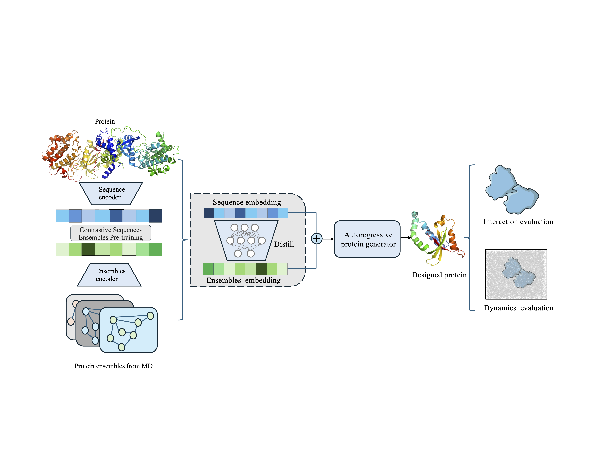

<p align="center">
  
</p>

# ProChoreo
ProChoreo is a framework for ensemble informed protein binder design.
## RUN ProChoreo

### Basic Command

```bash
python ./Evaluation/designer.py --config Evaluation/esm3B_distill.yaml 
```
## Dataset & model weights
The source datasets and pretrained models used in this project are hosted on Google Drive.

```bash
https://drive.google.com/drive/folders/1Fn8XtJhbtjS5vbtYKTHsiUpdFfGJqmsF?usp=drive_link
```


## Installation

### Conda Environment

```bash
conda env create -f environment.yml
conda activate PD
```

### Install esm
You must have PyTorch installed to use this repository,starting from an environment with python <= 3.9 .
```bash
pip install fair-esm 
```

### Install Boltz
Install boltz with PyPI, starting from a new environment
```bash
pip install boltz[cuda] -U
```

## Reference

```bibtex
@article{wohlwend2024boltz1,
  author = {Wohlwend, Jeremy and Corso, Gabriele and Passaro, Saro and Getz, Noah and Reveiz, Mateo and Leidal, Ken and Swiderski, Wojtek and Atkinson, Liam and Portnoi, Tally and Chinn, Itamar and Silterra, Jacob and Jaakkola, Tommi and Barzilay, Regina},
  title = {Boltz-1: Democratizing Biomolecular Interaction Modeling},
  journal = {bioRxiv},
  year = {2024},
  doi = {10.1101/2024.11.19.624167}
}

@article{mirdita2022colabfold,
  title   = {ColabFold: making protein folding accessible to all},
  author  = {Mirdita, Milot and Sch{\"u}tze, Konstantin and Moriwaki, Yoshitaka and Heo, Lim and Ovchinnikov, Sergey and Steinegger, Martin},
  journal = {Nature Methods},
  year    = {2022}
}

@article{lin2022language,
  title     = {Language models of protein sequences at the scale of evolution enable accurate structure prediction},
  author    = {Lin, Zeming and Akin, Halil and Rao, Roshan and Hie, Brian and Zhu, Zhongkai and Lu, Wenting and Smetanin, Nikita and dos Santos Costa, Allan and Fazel-Zarandi, Maryam and Sercu, Tom and Candido, Sal and others},
  journal   = {bioRxiv},
  year      = {2022},
  publisher = {Cold Spring Harbor Laboratory}
}
```

## Licence and Disclaimer

This project is released under the MIT License.
